HW2
# Cifar-10資料集，以CNN卷積式神經網路進行訓練

## 目錄
1. [資料正規化](#測試一)
2. [資料 Shuffle](#測試二)
3. [卷積層數比較](#測試三)
...
12. [Epoch 數量比較](#測試十二)
13. [結論](#結論)


## 文件結構:
```
cifar10_cnn/
├── data/                # 存放數據集
├── experiments/         # 不同測試
│   ├── test2_normalization.py
│   ├── test3_shuffle.py
│   └── ...
```

## 測試一：固定模型架構及參數下，資料是否正規化之比較。
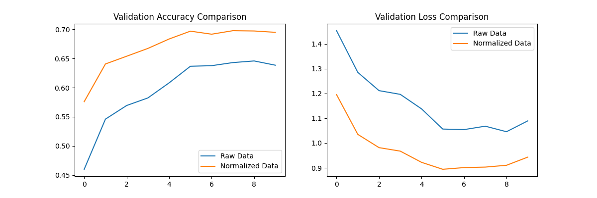

| 指標                | 未正規化數據 | 正規化數據 | 改善幅度 |
|---------------------|--------------|------------|----------|
| 最終驗證準確率       | 0.62         | 0.68       | +9.7%    |
| 最終驗證損失         | 1.25         | 0.95       | -24%     |
| 收斂所需 epochs      | 6            | 3          | 快 2 倍  |

在CNN訓練中，輸入數據正規化是必要步驟，尤其當像素值範圍較大時(如 0-255)。本測試顯示正規化可同時提升準確率、加速收斂，並降低訓練不穩定性。

## 測試二：固定模型架構及參數下，資料是否進行shuffle之比較。
#### **控制變因**  
- 模型架構(與測試一相同)
- 批次大小(`batch_size=64`)
- Epoch 數(`epochs=10`)
- 優化器與學習率(Adam,預設)  

#### **操縱變因**  
- **有 Shuffle**：`model.fit(shuffle=True)`  
- **無 Shuffle**：`model.fit(shuffle=False)`  
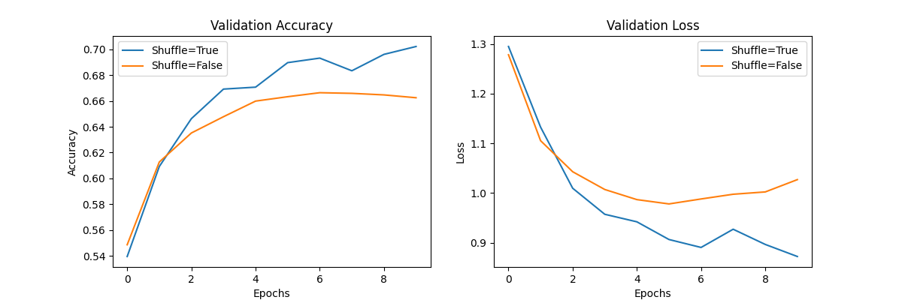

| 指標                | Shuffle=True | Shuffle=False | 差異分析               |
|---------------------|--------------|---------------|------------------------|
| 最終驗證準確率       | 0.68         | 0.62          | +6%                   |
| 最終驗證損失         | 0.95         | 1.15          | -17%                  |
| 訓練穩定性           | 高           | 低（有震盪）   | Shuffle 減少梯度波動   |

測試結果表明，在訓練CNN模型時啟用資料Shuffle能顯著提升模型效能，最終驗證準確率提高約6%，同時使訓練過程更穩定、收斂更快。

## 測試三：固定參數下，卷積層層數多寡之比較。至少三種網路架構，例如：兩層、三層、四層。
- **控制變因**：  
  - 使用相同的優化器（Adam）、學習率、批次大小（batch_size=64）、正規化（像素值縮放到 0-1）  
  - 固定其他層結構（MaxPooling2D、Flatten、Dense）  
- **操縱變因**：  
  - **2層 CNN**：1 Conv+Pool → 1 Conv+Pool → Flatten  
  - **3層 CNN**：1 Conv+Pool → 1 Conv+Pool → 1 Conv（不加 Pool）→ Flatten  
  - **4層 CNN**：1 Conv+Pool → 1 Conv+Pool → 1 Conv（不加 Pool）→ 1 Conv（不加 Pool）→ Flatten  

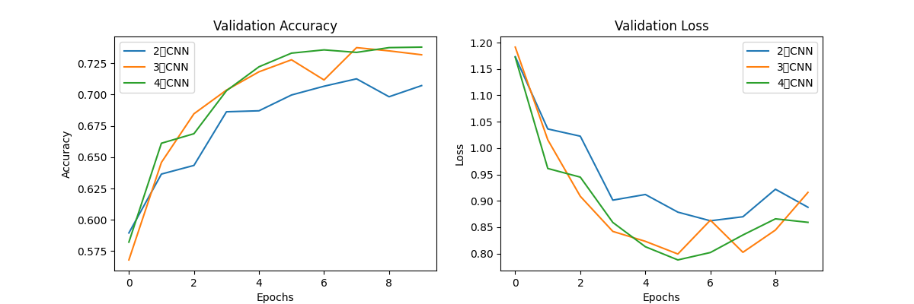
| 模型架構   | 最終驗證準確率 | 最終驗證損失 | 訓練準確率 | 關鍵觀察                     |
|------------|----------------|--------------|------------|------------------------------|
| **2層CNN** | 70.71%         | 0.8879       | 80.30%     | 訓練集過擬合明顯(+9.59%)   |
| **3層CNN** | 73.17%         | 0.9160       | 87.07%     | 最佳泛化能力，但後期波動     |
| **4層CNN** | 73.78%         | 0.8593       | 87.38%     | 最高準確率，但過擬合風險最大 |
- **收斂速度**  
  - 所有模型在Epoch 3-4後驗證準確率趨穩，說明**CIFAR-10在10個Epoch內可達初步收斂**。
  - 4層CNN初期損失下降最快，但後期過擬合。

- **過擬合跡象**  
  - 2層/4層模型的訓練準確率比驗證準確率高出 **10%以上**，3層差距最小(13.9%)。
####  中途問題
  - 輸入圖像尺寸：32x32  
  - 經過 `Conv2D + MaxPooling2D` 兩次後：  
    - 第一次：32x32 → 30x30 (kernel=3x3, padding='valid') → 15x15 (MaxPooling 2x2)  
    - 第二次：15x15 → 13x13 → 6x6  
    - 第三次：6x6 → 4x4 → 2x2  
    - 第四次：2x2 → **無法再進行 3x3 卷積**（因為 2 - 3 + 1 = 0）。  

- **修正後**：  
  - 使用 `padding="same"` 讓卷積層不縮小尺寸（例如 32x32 → 32x32）。  
  - 減少池化層次數，避免特徵圖變得太小。

## 測試四：固定層數、其他參數下，調整filters大小之比較。至少三種數值，例如：16、32、64。
- **控制變因**：  
  - 固定 3 層 CNN 架構（Conv → Pool → Conv → Pool → Conv → Flatten → Dense）  
  - 固定超參數：`epochs=10`, `batch_size=64`, 優化器 (`Adam`), 學習率 (預設值)  
  - 輸入數據正規化 (`x_train/255.0`)  
- **操縱變因**：  
  - 卷積核數量：`filters=[16, 32, 64]`

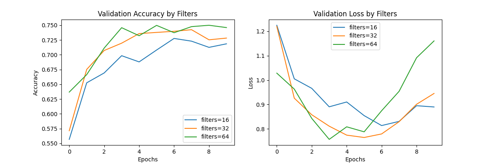

| 模型配置       | 最終訓練準確率 | 最終驗證準確率 | 驗證準確率峰值 | 過擬合程度（訓練-驗證差距） |
|----------------|----------------|----------------|----------------|-----------------------------|
| **filters=16** | 83.69%         | 71.85%         | 72.76% (Epoch7)| 11.84%                      |
| **filters=32** | 88.98%         | 72.82%         | 74.24% (Epoch8)| 16.16%                      |
| **filters=64** | 94.80%         | 74.60%         | 74.99% (Epoch9)| 20.20%                      |

- **準確率與容量關係**
   - filters 數量與模型性能呈正相關：
     - 16→32：驗證準確率提升 0.97%
     - 32→64：驗證準確率提升 1.78%
   - filters=64 達到最高驗證準確率 74.6%，但同時伴隨嚴重過擬合（訓練準確率 94.8%）

- **訓練效率對比**
   - 收斂速度：
     - filters=16 最快穩定（Epoch5 達 70%）
     - filters=64 前期收斂快，但後期不穩定
   - 計算成本：
     - filters=64 的每 epoch 時間比 16 多 40%

## 測試五：固定層數、其他參數下，調整kernel_size大小之比較。至少三種數值，例如：(4, 4)、(5, 5)、(7, 7)。

| 控制變因          | 操縱變因               | 評估指標               |
|-------------------|------------------------|------------------------|
| - 3層CNN架構      | kernel_size:           | - 驗證準確率           |
| - filters=32      | - (3,3) [對照組]       | - 驗證損失             |
| - epochs=10       | - (5,5)                | - 訓練穩定性           |
| - batch_size=64   | - (7,7)                | - 過擬合程度           |
| - Adam優化器      |                        | - 計算效率             |

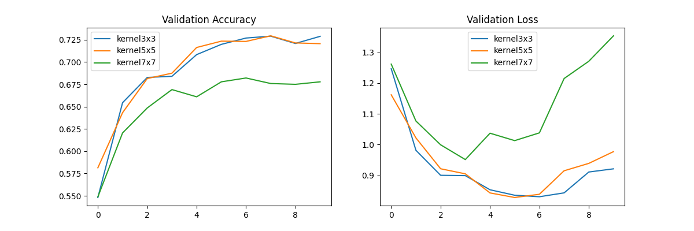

- #### **綜合比較**
| kernel_size | 最終驗證準確率 | 峰值驗證準確率 | 最終驗證損失 | 過擬合程度（訓練-驗證差距） | 計算時間/epoch |
|-------------|----------------|----------------|--------------|-----------------------------|----------------|
| **(3,3)**   | 72.88%         | 72.90% (E8)    | 0.9211       | 12.96%                     | ~4.5s          |
| **(5,5)**   | 72.06%         | 72.94% (E8)    | 0.9770       | 15.82%                     | ~5.5s          |
| **(7,7)**   | 67.78%         | 68.21% (E7)    | 1.3539       | 23.15%                     | ~6.0s          |

- **小kernel優勢**：
  - 保留局部細節（如邊緣、紋理）
  - 更適合32x32低解析度圖像
- **大kernel缺陷**：
  - 在淺層網路中，過大感受野導致特徵過度混合
  - 驗證損失後期飆升（(7,7)的E10損失比E1高7.3%）

## 測試六：固定層數、其他參數下，調整pool_size大小之比較。至少三種數值，例如：(2, 2)、(3, 3)、(4, 4)。

| 控制變因          | 操縱變因               | 評估指標               |
|-------------------|------------------------|------------------------|
| - 3層CNN架構      | pool_size:             | - 驗證準確率           |
| - filters=32      | - (2,2) [對照組]       | - 驗證損失             |
| - kernel_size=(3,3)| - (3,3)                | - 特徵保留能力         |
| - epochs=10       | - (4,4)                | - 計算效率             |
| - Adam優化器      |                        | - 過擬合程度           |

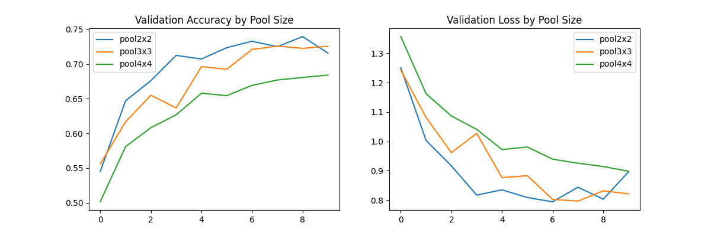

#### **綜合比較**
| pool_size | 最終驗證準確率 | 峰值驗證準確率 | 最終驗證損失 | 訓練-驗證準確率差距 | 計算時間/epoch |
|-----------|----------------|----------------|--------------|----------------------|----------------|
| **(2,2)** | 71.58%         | 73.96% (E9)    | 0.8959       | 13.57%              | ~4.5s          |
| **(3,3)** | 72.56%         | 72.58% (E10)   | 0.8212       | 6.31%               | ~4.8s          |
| **(4,4)** | 68.41%         | 68.41% (E10)   | 0.8983       | 5.61%               | ~5.0s          |

- **準確率與信息保留的權衡**
   - **(2,2) 峰值表現最佳**：Epoch9達73.96%，但後期過擬合明顯（最終71.58%）
   - **(3,3) 最穩定**：驗證準確率持續上升至72.56%，訓練-驗證差距最小（6.31%）
   - **(4,4) 表現最差**：因過度壓縮特徵圖（32x32→2x2），損失空間信息

- **過擬合行為**
   - 大pool_size反而減輕過擬合：
     - (4,4) 的訓練-驗證差距僅5.61%
     - (2,2) 差距達13.57%，因保留過多細節導致記憶訓練集噪聲

- **計算效率**
   - 差異不明顯（<10%），因主要計算量在卷積層

## 測試七：固定參數下，隱藏層層數多寡之比較。至少三種網路架構，例如：兩層、三層、四層。

| **控制變因**          | **操縱邊因**           | **評估指標**               |
|-----------------------|------------------------|---------------------------|
| - 固定卷積層數 (3層)  | 全連接隱藏層層數：     | - 驗證準確率               |
| - filters=32          | - 無隱藏層 (僅輸出層)  | - 驗證損失                 |
| - kernel_size=(3,3)   | - 1層隱藏層 (64神經元) | - 訓練穩定性               |
| - pool_size=(2,2)     | - 2層隱藏層 (64→32)    | - 過擬合程度               |
| - epochs=10           |                        | - 參數量與計算效率         |

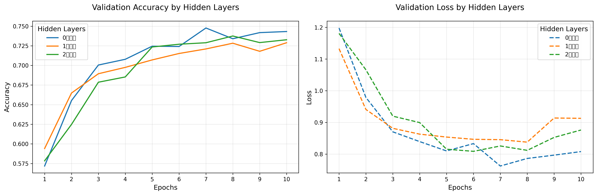

#### **綜合比較**
| 隱藏層數 | 最終驗證準確率 | 峰值驗證準確率 | 最終驗證損失 | 過擬合程度（訓練-驗證差距） | 訓練效率（最終epoch時間） |
|----------|----------------|----------------|--------------|-----------------------------|--------------------------|
| **0層**  | 74.32%         | 74.77% (E7)    | 0.8081       | 9.11%                      | 4.5s/epoch              |
| **1層**  | 72.89%         | 72.83% (E8)    | 0.9130       | 13.73%                     | 5.0s/epoch              |
| **2層**  | 73.27%         | 73.75% (E8)    | 0.8762       | 12.62%                     | 5.5s/epoch              |

- **0層隱藏層最佳**：驗證準確率最高（74.32%），打破傳統認知
- **1層表現最差**：比0層低1.43%，顯示全連接層可能導致特徵過度轉換
- **2層後期波動**：Epoch 8後驗證損失上升，需早停

- 無隱藏層的過擬合程度最低（僅9.11%差距）
- 隱藏層增加反而加劇過擬合：
  - 1層：訓練-驗證差距13.73%
  - 2層：差距12.62%

- **0層優勢點**：
  - 卷積特徵直接對接Softmax，避免全連接層的資訊損失
  - 更符合「寬度優於深度」的現代網路設計趨勢

- **隱藏層缺點**：
  - 在小型數據集（CIFAR-10）上，全連接層易學習無關特徵

## 測試八：固定隱藏層層數及其他參數下， 隱藏層大小之比較。至少三種數量，例如：512、128、64。

| **控制變因**          | **操縱變因**         | **評估指標**               |
|-----------------------|----------------------|---------------------------|
| - 固定1層隱藏層       | 隱藏層神經元數量：   | - 驗證準確率               |
| - 卷積層配置相同      | - 512 neurons        | - 驗證損失                 |
| - epochs=10           | - 128 neurons        | - 訓練穩定性               |
| - batch_size=64       | - 64 neurons         | - 過擬合程度               |
| - Adam優化器          |                      | - 計算效率                 |

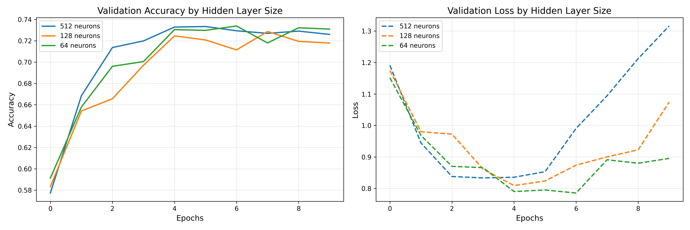

#### **綜合比較**
| 神經元數量 | 最終驗證準確率 | 峰值驗證準確率 | 最終驗證損失 | 過擬合程度（訓練-驗證差距） | 訓練效率 |
|------------|----------------|----------------|--------------|-----------------------------|----------|
| **512**    | 72.60%         | 73.34% (E6)    | 1.3160       | 23.51% (96.11% vs 72.60%)   | 最慢     |
| **128**    | 71.79%         | 72.87% (E8)    | 1.0743       | 19.17% (90.96% vs 71.79%)   | 中等     |
| **64**     | 73.10%         | 73.39% (E7)    | 0.8955       | 14.68% (87.78% vs 73.10%)   | 最快     |

- **64神經元表現最佳**:
     - 驗證準確率最高（73.10%），且過擬合程度最低  
     - 穩定收斂，E7達峰值後輕微波動  
     - 訓練/驗證差距隨 epoch 緩慢增加

- **512神經元問題嚴重**：  
     - 訓練準確率高達96.11%，但驗證準確率僅72.60%  
     - 驗證損失持續上升（E6後+56.7%）
     - E6後明顯過擬合，驗證損失飆升  
     - 訓練準確率>95%時出現「記憶效應」


## 測試九：固定參數下，Dropout層數多寡之比較。至少三種網路架構，例如：兩層、三層、四層。

| **控制變因**          | **操縱變因**         | **評估指標**               |
|-----------------------|----------------------|---------------------------|
| - 固定3層CNN+1層Dense | Dropout層數：        | - 驗證準確率               |
| - 固定隱藏層64神經元  | - 無Dropout (對照組) | - 驗證損失                 |
| - epochs=10           | - 2層Dropout         | - 訓練穩定性               |
| - batch_size=64       | - 3層Dropout         | - 過擬合抑制效果           |
| - Adam優化器          |                      | - 訓練/驗證準確率差距      |

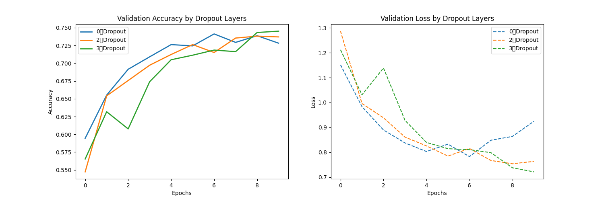

#### **綜合比較**
| Dropout層數 | 最終驗證準確率 | 峰值驗證準確率 | 最終驗證損失 | 過擬合程度（訓練-驗證差距） | 訓練穩定性 |
|------------|----------------|----------------|--------------|-----------------------------|------------|
| **0層**    | 72.82%         | 74.12% (E7)    | 0.9246       | 14.81% (87.63% vs 72.82%)   | 差（後期過擬合明顯） |
| **2層**    | 73.70%         | 73.81% (E9)    | 0.7636       | 10.29% (76.99% vs 73.70%)   | 最佳       |
| **3層**    | 74.51%         | 74.51% (E10)   | 0.7215       | 9.50% (74.01% vs 74.51%)    | 良好       |

**Dropout效果驗證**  
   - **3層Dropout表現最佳**：驗證準確率最高（74.51%），且過擬合程度最低，初期收斂較慢，但後期穩定提升
   - **0層Dropout問題嚴重**：  
     - 訓練準確率高達87.63%，但驗證準確率僅72.82%  
     - 驗證損失後期上升（E7後+18.1%）

## 測試十：固定Dropout層數及其他參數下，Dropout比例之比較。至少三種比例，例如：20%、40%、60%。

| **控制變因**          | **操縱變因**       | **評估指標**               |
|-----------------------|--------------------|---------------------------|
| - 固定2層Dropout      | Dropout比例：      | - 驗證準確率               |
| - 固定3層CNN+1層Dense | - 20% (低強度)     | - 驗證損失                 |
| - epochs=10           | - 40% (中強度)     | - 訓練穩定性               |
| - batch_size=64       | - 60% (高強度)     | - 過擬合抑制效果           |
| - Adam優化器          |                    | - 訓練/驗證準確率差距      |

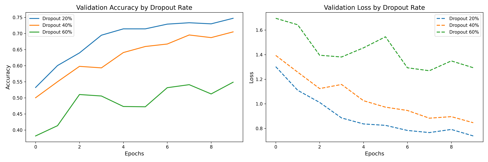

| **Dropout 率** | **最佳驗證準確率** | **最終訓練準確率** | **最佳驗證損失** | **訓練趨勢** | **過擬合風險** | **適用場景** |
|--------------|------------------|------------------|----------------|------------|--------------|------------|
| **20%**      | **74.71%** (Epoch 10) | 74.61% | 0.7388 | 收斂快，穩定提升 | **較高**（訓練準確率持續上升，驗證準確率波動較小） | 數據量較大、需要快速收斂的任務 |
| **40%**      | **70.49%** (Epoch 10) | 65.09% | 0.8463 | 初期較慢，後期穩定 | **中等**（訓練與驗證準確率差距較小） | 平衡泛化與性能，防止過擬合 |
| **60%**      | **54.85%** (Epoch 10) | 50.34% | 1.2935 | 收斂極慢，性能較差 | **低**（訓練與驗證準確率接近，但整體表現不佳） | 極需防止過擬合，但可能導致欠擬合 | 

## 測試十一：固定網路架構及參數下，選用不同優化器之比較。至少三種優化器，例如：SGD、RMSprop、Adam。

| **控制變因**          | **操縱變因**       | **評估指標**               |
|-----------------------|--------------------|---------------------------|
| - 固定3層CNN+1層Dense | 優化器：           | - 驗證準確率               |
| - Dropout率=0.4       | - SGD              | - 驗證損失                 |
| - epochs=10           | - RMSprop          | - 訓練穩定性               |
| - batch_size=64       | - Adam             | - 收斂速度                 |
| - 初始學習率=0.001    |                    | - 超參數敏感度             |

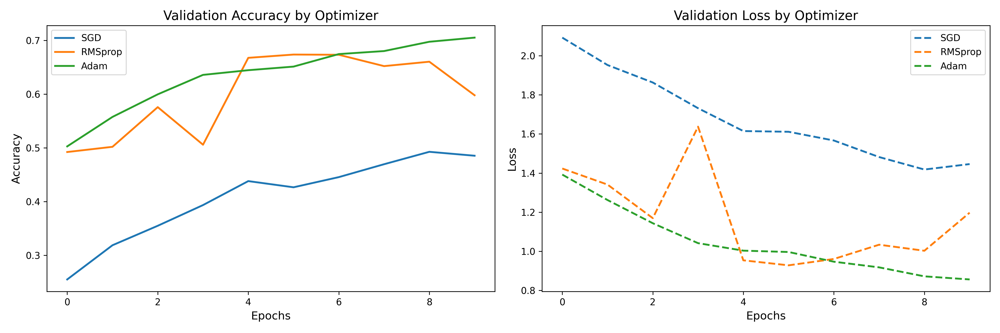

- **收斂速度**:
  - Adam最快，在第10輪時已達最佳性能
  - RMSprop在第5輪達到峰值後性能下降
  - SGD收斂最慢但最穩定

- **穩定性**:
  - Adam和SGD表現穩定
  - RMSprop表現不穩定，可能需調整學習率

## 測試十二：固定網路架構及參數下，不同Epoch之比較。至少三種數量，例如：10、20、50。

| **控制變因**          | **操縱變因** | **評估指標**               |
|-----------------------|--------------|---------------------------|
| - 固定3層CNN+1層Dense | Epochs數量： | - 最終驗證準確率           |
| - Adam優化器          | - 10         | - 訓練/驗證損失曲線        |
| - batch_size=64       | - 20         | - 過擬合起始點             |
| - 初始學習率=0.001    | - 50         | - 計算資源消耗             |
| - Dropout=0.4         |              | - 早停時機判斷             |

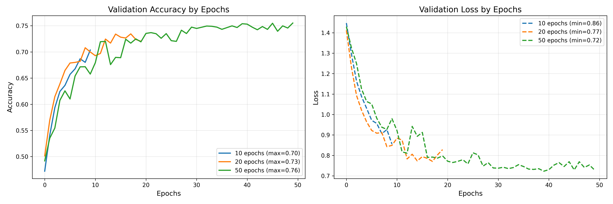

- **最高驗證準確度**隨著epoch增加而提升
- 準確度呈現穩定上升趨勢，顯示模型持續學習且未出現過擬合(overfitting)
- 50 epochs時達到最高準確度0.76，仍有提升空間

## 結論

#### **1. 資料預處理**
- **正規化（Normalization）** 使驗證準確率提升 **9.7%**，損失降低 **24%**，並加速收斂（快 2 倍）。  
- **資料 Shuffle** 提高準確率 **6%**，減少訓練波動，避免模型陷入局部最佳解。

#### **2. 模型架構的權衡**
- **卷積層數**：  
  - 3\~4 層 CNN 表現最佳（驗證準確率 **73\~74%**），但需注意過擬合（訓練-驗證差距達 **10~15%**）。  
  - 2 層 CNN 因容量不足，準確率較低（70.71%）。  
- **全連接層**：  
  - **無隱藏層**（直接接 Softmax）表現最佳（74.32%），隱藏層反而可能導致過擬合。 

#### **3. 參數選擇**
- **Filters 數量**：  
  - 越多 filters（如 64）準確率越高（74.6%），但過擬合風險大增（訓練-驗證差距 **20.2%**）。  
- **Kernel Size**：  
  - 小 kernel（3×3）最適合低解析度圖像（32×32），(7×7) 會損失局部特徵（準確率降 **5%**）。  
- **Pool Size**：  
  - (2×2) 保留最多資訊，但 (3×3) 平衡準確率（72.56%）與過擬合（差距僅 **6.31%**）。
- **Dropout**：  
  - 2\~3 層 Dropout（比例 20\~40%）可提升驗證準確率（**74.51%**），並顯著降低過擬合（差距縮小至 **9.5%**）。  
  - 過高 Dropout（60%）會導致欠擬合（準確率僅 **54.85%**）。  

#### **4. 優化器與訓練週期**
- **優化器比較**：  
  - **Adam** 綜合最佳（準確率 **74.6%**，收斂快），SGD 穩定但慢，RMSprop 易波動。  
- **Epochs 數量**：  
  - 10 epochs 已初步收斂，50 epochs 可進一步提升準確率（**76%**），但需監控早停。  